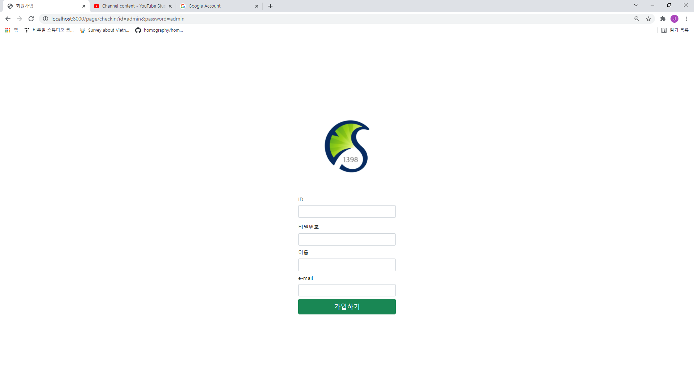
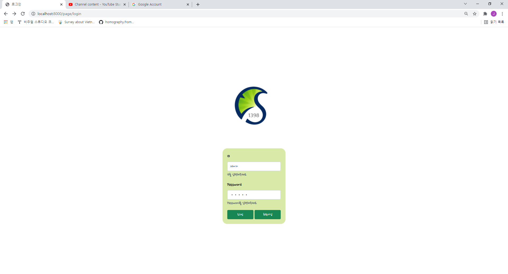
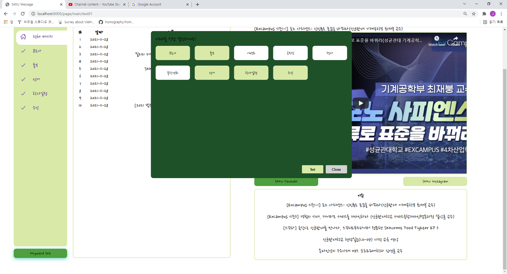
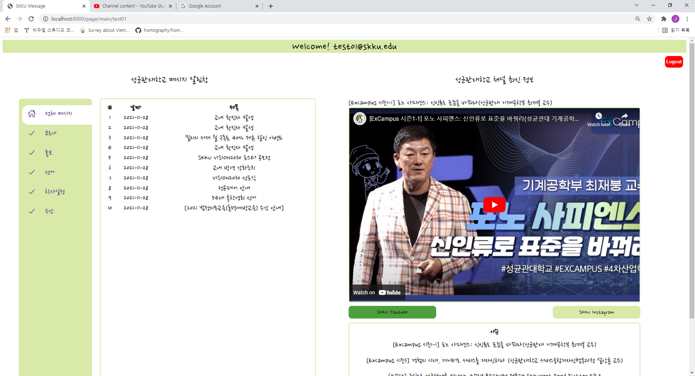
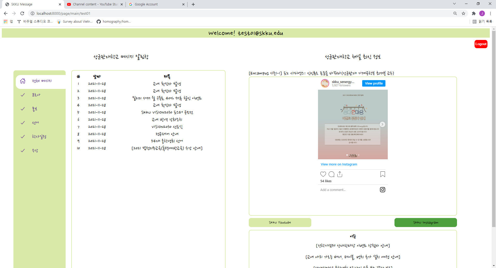

# oss_skku_message
oss_skku_message_system

## THE NAME OF APP
**_SKKU-MESSAGE-MANAGER_**
## screenshots of your APP





## 유튜브링크

[Youtube](http://www.youtube.com/watch?v=6Y1kWcrFKQo)

## 설치안내

- Requirements
  - Python 3.7 +
  - Mysql Server (only when run in local)
  - python moules (specified in requirements.txt) install with
    ```
    pip install -r requirements.txt
    ```
    - fastapi
    - uvicorn
    - jinja2
    - python-multipart
    - sqlalchemy
    - mysql-connector-python
    - starlette

## 사용방법

shell script:

```
python3 server/app/main.py
```
[address]https://localhost:8000/page/login
=======
For database access contact to YoungJaeBae: qodudwos@gmail.com

[Youtube](https://www.youtube.com/watch?v=TVhHDLBnD54)
<ol>
  <li>사용방법
    <ul>
      <li>성균관대학교 메시지 알림창 기능</li>
    <ol>
      <li>회원가입 후 로그인합니다.</li>
      <li>메인페이지에서 좌측의 "keyword set"버튼을 눌러 원하는 키워드를 세팅힙니다.</li>
      <li>세팅한 키워드를 눌러 관련 메시지를 조회합니다. </li>
    </ol>
      <li>성균관대학교 채널 최신 정보 기능</li>
      <ol>
      <li>"Youtube", "Instagram"버튼을 눌러 원하는 채널을 선택합니다.</li>
      <li>하단의 <이슈>테이블에서 원하는 게시물을 선택하여 조회합니다.</li>
    </ol>
  </li>
  </ol>
  
>>>>>>> da3090073806f9f840a9d08f16c62b91783e1f78
